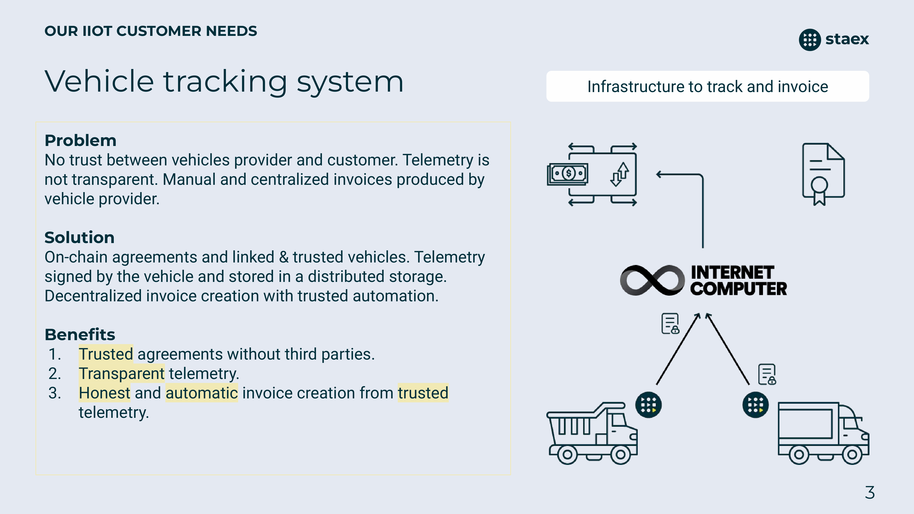

# Vehicle Tracking System

Vehicle Tracking System (VTS) - infrastructure to track and invoice vehicles.

The goal of this project is to develop trusted, transparent and automatic infrastructure to use, rent and track vehicles by different entities.

## Components

[firmware](./firmware/) \
[gateway](./gateway/) \
[canisters](./canisters/) \
[vts-ui](./vts-ui/)
