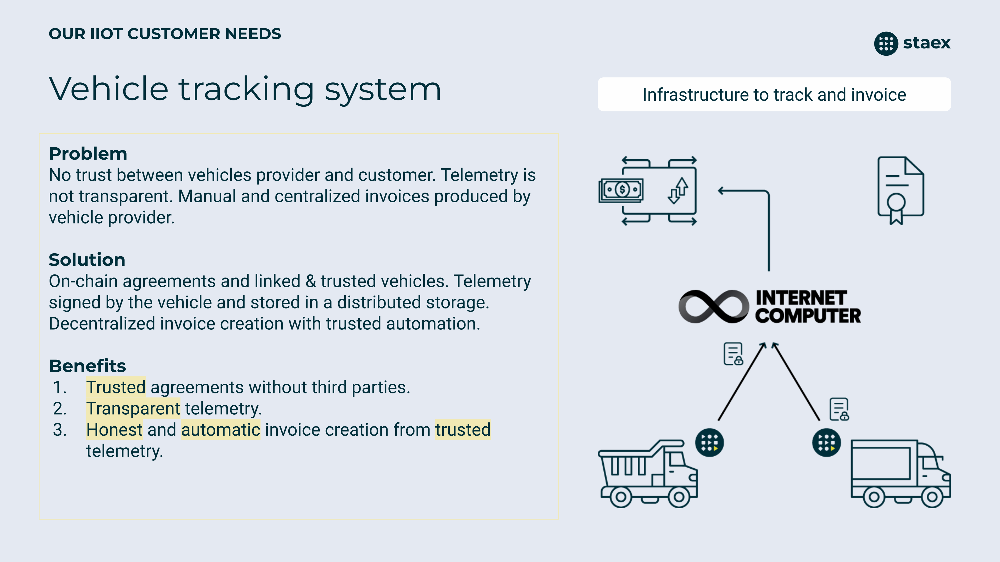

# Vehicle Tracking System

Vehicle Tracking System (VTS) - infrastructure to track and invoice vehicles.

The goal of this project is to develop trusted, transparent and automatic infrastructure to use, rent and track vehicles by different entities.

Current solution from our partner is centralized. That's why there is no trust between the vehicle customer (who uses and pays for the vehicle) and vehicle provider (who gives the vehicle). Contracts (agreements) are signed on the paper and still require trust from the vehicle customer and vehicle provider to our partner because every invoice is produced by them and their cloud servers.

So we want to improve this pipeline by utilizing the ICP network with on device telemetry signing. We are happy to create this PoC on the ICP network because it can store large amounts of data on-chain and has a reverse gas model so software on vehicles doesn’t need to have tokens and we can get on our own gas fees instead of our customers and partners.

Vehicle customers and vehicle providers can create and sign on-chain agreements with particular conditions, like price for gas and distance. To use or rent a new vehicle, vehicle customers build unique firmware with embedded newly created private key and link public key on-chain to signed agreement. When a vehicle produces telemetry, it signs it with their embedded private key and stores it on-chain using an ICP canister. ICP will execute the canister once a month to issue an invoice and unblock vehicles after the invoice is paid.

## Components

[firmware](./firmware/) \
[gateway](./gateway/) \
[gateway-tcp](./gateway-tcp/) \
[canisters](./canisters/) \
[vts-ui](./vts-ui/)
